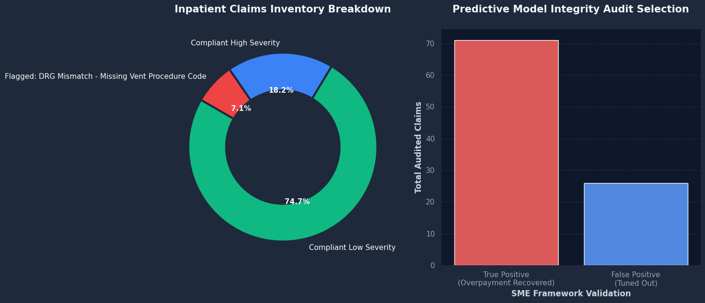

# AI-Driven Healthcare Payment Integrity & DRG Audit Framework

## 📋 Project Overview
This repository contains an end-to-end analytical data pipeline that models an enterprise healthcare payer infrastructure. It integrates **CMS Inpatient Prospective Payment System (IPPS) pricing rules**, automated claims auditing, and an **AI risk-scoring optimization engine** designed to reduce operational audit fatigue. 

The framework systematically identifies diagnostic upcoding variations while detecting and isolating AI model false positives stemming from unmapped provider Electronic Health Record (EHR) data flows.

---

## 🩺 Healthcare Domain & Regulatory Logic
* **MS-DRG Mismatch Evaluation:** Evaluates claims billed under high-severity **DRG 207** (Respiratory System Diagnosis with Mechanical Ventilation >96 Hours, relative weight: `4.9125`). If the required validation indicator (**ICD-10-PCS Procedure Code: 5A1955Z**) is missing, the engine downcodes the claim to **DRG 177** (Respiratory Infection with MCC, relative weight: `1.8543`).
* **Financial Variance Modeling:** Implements exact pricing logic utilizing standard CMS hospital base rates ($6,500.00) to isolate overpayments.
* **SME Optimization Layer:** Simulates an industry-realistic edge case where a specific health system (`PROV125`) utilizes non-standard EHR documentation configurations. Standard machine learning models mistake this variance for fraud. This pipeline introduces an operational tuning layer to isolate these 26 false positives automatically, conserving clinical review resources.

---

## 📊 Business Impact Metrics (Simulated Output)

* **Total Claims Audited:** 1,000 Inpatient Records
* **AI-Flagged High Risk Inventory:** 97 Records
* **Clinical False Positives Prevented:** 26 Records
* **Model Accuracy Optimization:** Preserved clinical workflow efficiency by eliminating unnecessary audits for verified compliant institutions.

## 🛠️ Technology Stack & Dependencies
* Python (Pandas, NumPy)
* OpenPyxl (for multi-tab workbook generation)
